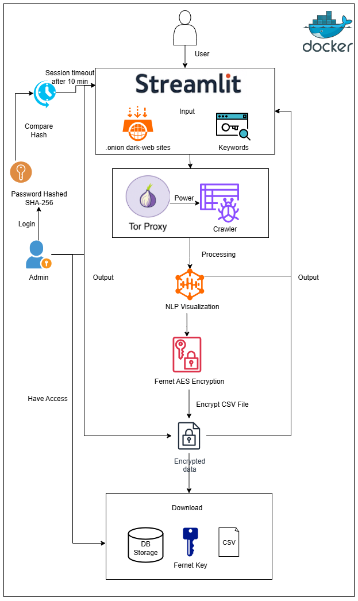

## 🕵️ Passive Dark Web Crawler for Cyber Threat Intelligence (CTI) Extraction

A **passive Tor-based crawler** that scans `.onion` sites for cyber threat intelligence indicators, using keyword matching and NLP to extract relevant data.  
The system ensures **user anonymity**, **secure data storage**, and **controlled access** via authentication.  
It features an interactive **Streamlit GUI**, **encrypted exports**, and **Dockerized deployment** for ease of use.

---

### 📸 Features

* 🌐 **Tor Integration** — All traffic routed through Tor SOCKS5 proxy for anonymity
* 🔍 **Keyword Matching** — Regex-based search with contextual snippets
* 🧠 **NLP Analysis** — Token frequency charts, stopword removal, and word clouds
* 🔐 **Encrypted Data Export** — Fernet AES encryption for exported CSVs
* 🛡 **Admin Authentication** — SHA-256 hashed password with session timeout
* 📊 **SQLite Storage** — Structured CTI data with easy querying
* 🐳 **Dockerized Deployment** — Runs with Tor and dependencies preconfigured

---

### 🚀 Architecture Overview



---

### 🛠️ Tech Stack

* **Frontend**: [Streamlit](https://streamlit.io/)
* **Crawling**: Tor + Requests
* **Parsing**: [BeautifulSoup](https://www.crummy.com/software/BeautifulSoup/)
* **NLP**: [NLTK](https://www.nltk.org/)
* **Database**: SQLite
* **Encryption**: [Cryptography Fernet](https://cryptography.io/)
* **Auth**: Python `hashlib` (SHA-256)
* **Deployment**: Docker

---

### 📦 Installation

#### Option 1: Run Locally

```bash
# Clone the repo
git clone https://github.com/wael-fahmy/dark-web-crawler-streamlit.git
cd dark-web-crawler-streamlit

# (Optional) Create a virtual environment
python -m venv venv
source venv/bin/activate  # Windows: venv\Scripts\activate

# Install dependencies
pip install -r requirements.txt

# Run the app
streamlit run app.py
````

Make sure **Tor** is installed and running locally (default SOCKS5 port `9050`).

---

#### Option 2: Run via Docker

```bash
# Build the image
docker build -t darkweb-crawler .

# Run the container
docker run -p 8501:8501 darkweb-crawler
```

Then open [http://localhost:8501](http://localhost:8501) in your browser.

---

### 📁 Project Structure

```
.
├── app.py                  # Streamlit GUI + backend logic
├── requirements.txt        # Python dependencies
├── Dockerfile              # Docker build config
├── docs/
│   └── architecture.drawio.png
└── README.md
```

---

### 🧪 How It Works

1. User enters `.onion` URLs and keywords in the Streamlit GUI.
2. The crawler routes all requests through Tor to avoid IP leakage.
3. HTML content is parsed using BeautifulSoup, removing HTML tags and scripts.
4. Regex-based keyword matching detects CTI indicators, saving context snippets.
5. NLP module (NLTK) generates token frequency lists and word clouds.
6. Data is saved to SQLite and can be exported as an **encrypted CSV**.
7. Admin login allows downloading the decryption key and raw database.

---

### 📊 Example Output

| URL                | Keyword | Context Snippet                        |
| ------------------ | ------- | -------------------------------------- |
| abcdef.onion/forum | malware | "... detected malware variant XYZ ..." |
| xyz123.onion/dumps | exploit | "... selling exploit kit ABC ..."      |

---

### 🧱 Future Improvements

* Named Entity Recognition (NER) for better IOC detection
* Full-database encryption using SQLCipher
* Scheduled crawling with incremental updates
* Integration with visualization dashboards (ElasticSearch, Kibana)

---

### 🧾 Citation

If you use this project, please cite:

```
@misc{fahmy2025darkweb,
  title={Passive Dark Web Crawler for Cyber Threat Intelligence Extraction and Visualization},
  author={Wael Fahmy and Amirhossein Zeinali Dehaghani},
  year={2025},
  note={Computer Security Course Project, Lakehead University}
}
```
### 📬 Contact

For questions or feedback, please contact:

* Wael Fahmy: [wfahmy@lakeheadu.ca](mailto:wfahmy@lakeheadu.ca)
* Amirhossein Zeinali Dehaghani: [azeinali@lakeheadu.ca](mailto:azeinali@lakeheadu.ca)


